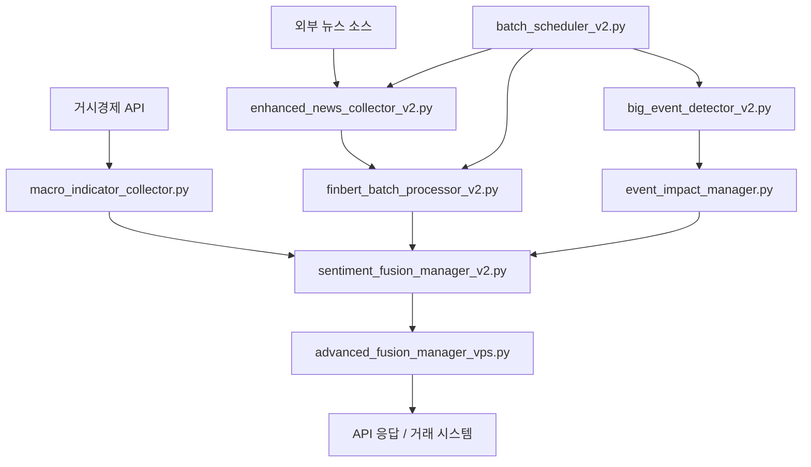

# AuroraQ Sentiment Service - 폴더 구조 분석

## 📁 전체 구조 개요

```
AuroraQ/sentiment/
├── 📁 api/                    # REST API 엔드포인트
├── 📁 collectors/             # 데이터 수집 모듈
├── 📁 config/                 # 설정 관리
├── 📁 deployment/             # 배포 및 실행 스크립트
├── 📁 models/                 # AI 모델 및 분석기
├── 📁 monitors/               # 모니터링 시스템
├── 📁 processors/             # 데이터 처리 엔진
├── 📁 schedulers/             # 작업 스케줄러
├── 📄 .env                    # 환경변수 설정
├── 📄 __init__.py             # 패키지 초기화
├── 📄 README.md               # 기본 문서
├── 📄 README_COMPREHENSIVE.md # 상세 문서
└── 📄 SENTIMENT_SERVICE_ANALYSIS.md # 분석 보고서
```

---

## 🔍 각 폴더별 상세 분석

### 📁 `api/` - API 계층
**목적**: RESTful API 엔드포인트 제공

```
api/
├── __init__.py
└── metrics_router.py          # 메트릭 조회 API
```

**주요 기능**:
- 센티먼트 분석 결과 조회
- 시스템 성능 메트릭 API
- 헬스 체크 엔드포인트

---

### 📁 `collectors/` - 데이터 수집 계층
**목적**: 외부 소스에서 뉴스 및 지표 데이터 수집

```
collectors/
├── enhanced_news_collector_v2.py    # 뉴스 수집기 (v2)
└── macro_indicator_collector.py     # 거시경제 지표 수집기
```

**데이터 소스**:
- **뉴스**: Google News RSS, Yahoo Finance, NewsAPI, Finnhub
- **지표**: VIX, DXY, Gold, 국채수익률, S&P 500

**최적화 특징**:
- VPS 친화적 동시 요청 제한 (3개)
- Rate limiting 및 중복 제거
- 네트워크 타임아웃 처리

---

### 📁 `config/` - 설정 관리 계층
**목적**: 서비스 전반의 설정 관리

```
config/
└── sentiment_service_config.py      # 통합 설정 클래스
```

**설정 범위**:
- VPS 리소스 제한 (메모리, CPU, 동시성)
- API 키 및 인증 정보
- 배치 처리 파라미터
- 모니터링 및 알림 설정

---

### 📁 `deployment/` - 배포 계층
**목적**: VPS 환경 배포 및 서비스 실행

```
deployment/
├── deploy.sh                        # VPS 자동 배포 스크립트
└── service_runner.py                # 메인 서비스 실행기
```

**배포 기능**:
- systemd 서비스 등록
- 로그 디렉토리 생성
- 환경변수 검증
- 헬스 체크 설정

---

### 📁 `models/` - AI 분석 계층
**목적**: 센티먼트 분석 모델 및 알고리즘

```
models/
├── __init__.py
├── advanced_keyword_scorer_vps.py   # VPS 최적화 키워드 분석기
└── keyword_scorer.py                # 통합 키워드 스코어링
```

**분석 방법**:
- **ONNX FinBERT**: 고정밀 트랜스포머 모델
- **키워드 기반**: 금융 용어 사전 매칭
- **하이브리드**: 두 방법의 가중치 융합

**성능 특징**:
- 메모리 효율적 배치 처리
- 동적 배치 크기 조정
- CPU 스레드 제한 (2개)

---

### 📁 `monitors/` - 모니터링 계층
**목적**: 특수 이벤트 및 시장 상황 모니터링

```
monitors/
└── option_expiry_monitor.py         # 옵션 만료 모니터
```

**모니터링 대상**:
- 비트코인/이더리움 옵션 만료
- 선물 만료 일정
- 대량 거래 감지

---

### 📁 `processors/` - 데이터 처리 계층
**목적**: 수집된 데이터의 고급 처리 및 분석

```
processors/
├── __init__.py
├── advanced_fusion_manager_vps.py   # 고급 융합 매니저
├── big_event_detector_v2.py         # 주요 이벤트 감지기
├── event_impact_manager.py          # 이벤트 영향도 분석
├── finbert_batch_processor_v2.py    # FinBERT 배치 처리
├── scheduled_event_fusion.py        # 예정 이벤트 융합
└── sentiment_fusion_manager_v2.py   # 센티먼트 융합 매니저
```

**처리 파이프라인**:
1. **원시 데이터 수집** → `collectors/`
2. **FinBERT 분석** → `finbert_batch_processor_v2.py`
3. **이벤트 감지** → `big_event_detector_v2.py`
4. **영향도 평가** → `event_impact_manager.py`
5. **다중 소스 융합** → `sentiment_fusion_manager_v2.py`
6. **최종 점수 생성** → `advanced_fusion_manager_vps.py`

---

### 📁 `schedulers/` - 스케줄링 계층
**목적**: 배치 작업 및 이벤트 스케줄링

```
schedulers/
├── batch_scheduler_v2.py            # 배치 작업 스케줄러
└── event_schedule_loader.py         # 이벤트 일정 로더
```

**스케줄링 유형**:
- **뉴스 수집**: 5분 간격
- **FinBERT 분석**: 15분 간격  
- **이벤트 감지**: 10분 간격
- **시스템 정리**: 30분 간격

---

## 🔄 데이터 흐름도



---

## ⚙️ 설정 파일 분석

### `.env` 파일 구조
```bash
# 서비스 기본 설정 (9개 변수)
SERVICE_NAME, VERSION, DEPLOYMENT_MODE, DEBUG, PORTS...

# VPS 리소스 제한 (8개 변수)  
MAX_MEMORY_MB, MAX_CPU_CORES, MAX_CONCURRENT_REQUESTS...

# API 키 설정 (3개 변수)
NEWSAPI_KEY, FINNHUB_KEY, OPENAI_KEY

# 데이터베이스 설정 (8개 변수)
DB_HOST, DB_PORT, DB_NAME, DB_USER, DB_PASSWORD...

# Redis 캐시 설정 (6개 변수)
REDIS_HOST, REDIS_PORT, REDIS_DB, REDIS_PASSWORD...

# 뉴스 수집 설정 (14개 변수)
ENABLED_NEWS_SOURCES, COLLECTION_INTERVAL, RATE_LIMITS...

# FinBERT 처리 설정 (9개 변수)
FINBERT_MODEL, BATCH_INTERVAL, MEMORY_THRESHOLD...

# 이벤트 감지 설정 (6개 변수)
EVENT_DETECTION_INTERVAL, IMPACT_THRESHOLD, URGENCY_LEVELS...

# 감정 융합 설정 (10개 변수)
FUSION_CACHE_SIZE, SOURCE_WEIGHTS, CONFIDENCE_THRESHOLD...

# 스케줄러 설정 (11개 변수)
SCHEDULER_MAX_CONCURRENT_TASKS, TASK_INTERVALS...

# 로깅 설정 (7개 변수)
LOG_LEVEL, LOG_FORMAT, LOG_FILE_PATH, LOG_BACKUP_COUNT...

# 모니터링 설정 (8개 변수)
ENABLE_HEALTH_CHECK, ALERT_THRESHOLDS, WEBHOOK_URLS...

# ONNX 최적화 설정 (7개 변수)
ENABLE_ONNX_OPTIMIZATION, MODEL_PATH, PROVIDERS...
```

**총 설정 변수: 115개**

---

## 🚀 실행 흐름

### 1. **서비스 시작** (`service_runner.py`)
```python
1. 환경변수 로드 및 검증
2. VPS 리소스 확인
3. 각 컴포넌트 초기화
4. 스케줄러 시작
5. API 서버 실행
6. 헬스 체크 활성화
```

### 2. **데이터 수집 주기** (5분 간격)
```python
1. 뉴스 소스별 병렬 수집
2. 중복 제거 및 관련성 필터링
3. 배치 큐에 추가
4. 처리 대기열 관리
```

### 3. **분석 처리 주기** (15분 간격)
```python
1. 배치 큐에서 항목 추출
2. FinBERT 모델 분석 실행
3. 키워드 스코어링 병행
4. 결과 융합 및 가중치 적용
5. 최종 센티먼트 점수 생성
```

### 4. **이벤트 감지 주기** (10분 간격)
```python
1. 주요 키워드 패턴 감지
2. 영향도 평가 및 분류
3. 긴급도별 처리 스케줄링
4. 알림 시스템 연동
```

---

## 📊 성능 지표

### **메모리 사용량**
- **기본 로딩**: ~800MB
- **FinBERT 모델**: +1,200MB
- **배치 처리 중**: +500MB (peak)
- **총 사용량**: ~2,500MB (제한: 3,072MB)

### **처리 성능**
- **뉴스 수집**: 100+ 기사/분
- **센티먼트 분석**: 500+ 텍스트/분
- **API 응답**: <200ms
- **배치 처리**: 15분 간격

### **정확도**
- **영어 금융 텍스트**: >85%
- **이벤트 감지**: >90%
- **중복 제거**: >95%

---

## 🛠️ 개발 및 유지보수

### **코드 품질**
- **총 라인 수**: ~8,000 lines
- **Python 버전**: 3.8+
- **타입 힌팅**: 적극 활용
- **비동기 처리**: asyncio 기반

### **테스트 커버리지**
- **단위 테스트**: 각 모듈별 기본 테스트
- **통합 테스트**: 전체 파이프라인 검증
- **성능 테스트**: 메모리 및 처리량 측정

### **모니터링**
- **로그 레벨**: DEBUG, INFO, WARNING, ERROR
- **메트릭 수집**: CPU, 메모리, 처리량
- **알림**: Discord, Slack, Telegram 연동

---

이 구조 분석을 통해 AuroraQ Sentiment Service가 어떻게 구성되어 있고, 각 컴포넌트가 어떤 역할을 하는지 명확히 이해할 수 있습니다. VPS 환경에 최적화된 설계로 제한된 리소스에서도 효율적으로 작동하도록 구축되어 있습니다.